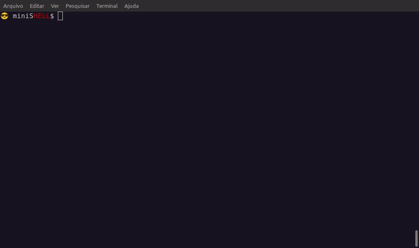
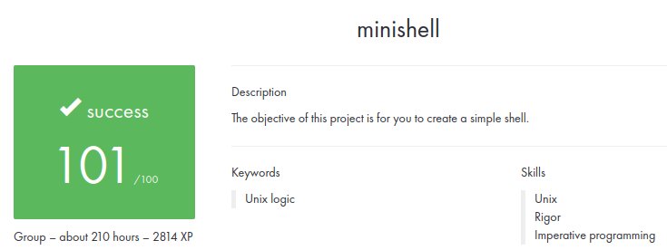

# Minishell

### 💡 About the project

This project aims to develop a basic shell, similar to a customized version of bash. A hands-on exploration of processes and file descriptors.

Authors:  
[caesar](https://github.com/WicCaesar)  
[rodrigo](https://github.com/carvalho-ra)  

### 🛠️ Usage

Compile the project using the provided Makefile: ```make```

Run binary: ```./minishell```



### 📋 Results



<svg role="img" viewBox="0 0 24 24" xmlns="http://www.w3.org/2000/svg"><title>42</title><path d="M19.581 16.851H24v-4.439ZM24 3.574h-4.419v4.42l-4.419 4.418v4.44h4.419v-4.44L24 7.993Zm-4.419 0h-4.419v4.42zm-6.324 8.838H4.419l8.838-8.838H8.838L0 12.412v3.595h8.838v4.419h4.419z"/></svg>
